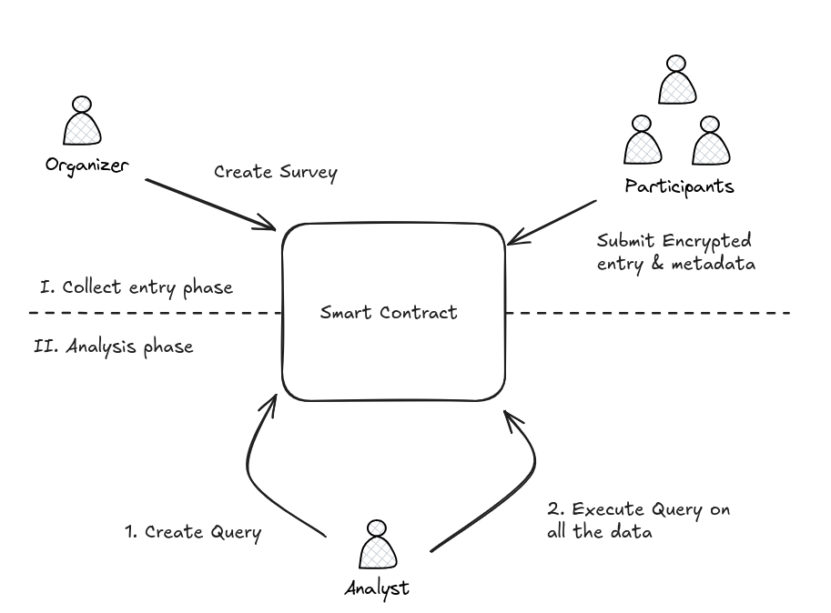

<a id="readme-top"></a>

<br />
<div align="center">
  <a href="#">
    
  </a>

<h3 align="center">Private Polling & Benchmark Protocol</h3>
<p align="center" style="font-style: italic; font-size: 1.2em;">Built during <a href="https://github.com/zama-ai/bounty-program/issues/144">ZAMA Bounty Program - Season 8</a></p>
  <p align="center">
    A trustless on-chain solution for privacy-preserving surveys and benchmarking using FHE.
    <br />
    <br />
    <a href="https://github.com/RegisGraptin/trust-poll">Code</a>
    &middot;
    <a href="#">View Demo</a>
    &middot;
    <a href="#">Video Presentation</a>
  </p>
</div>

## About The Project

Participating in traditional polling or benchmarking forces you to surrender private data to third parties—a fragile system where your sensitive information becomes their liability. What if your data could contribute to collective insights without ever being exposed, even during analysis?

This is the promise of PrivatePolls, a propose private polling protocol using Fully Homomorphic Encryption (FHE). This protocol empowers organizations and individuals to conduct encrypted opinion polls (e.g., “Should our DAO fund AI startups?”) and benchmarks (e.g., anonymized salary comparisons) without ever exposing raw data.

## Features

By leveraging Zama’s FHEVM, PrivatePolls enables:

- Encrypted submissions: Respondents submit data that remains cryptographically sealed, even during computation.

- Threshold-based insights: Aggregate results are revealed only when predefined privacy thresholds (e.g., 50+ participants) are met, preventing individual data leaks.

- Role-based access: Organizers define survey parameters, analysts pay to query encrypted datasets, and participants retain full ownership of their sensitive inputs.

- Built for blockchain-native governance, salary transparency, and healthcare surveys. PrivatePolls replaces fragile trust models with mathematically enforced privacy.

## Design architecture

Our protocol uses a single smart contract to manage both private polling and benchmarking. This design is mainly motivated by a business perspective allowing us to manage more easily reward mechanisms for the participants. See more in business opportunity section. However, this does not impact the logic of the polling/benchmark as in both cases, we are going to count the number of entries and the total sum of the votes, allowing us to do the average or the mean depending of the type of entry we are requested.

PrivatePolls can be decomposed in two phases. The voting phase and the analyse one. During the voting time, users can submit new entry to the survey. Once the vote is finished, and we have enough participants according to the threshold parameter, the survey result is decrypted. Then the analyse phase is unlock allowing anyone one to request new analyse on the metadata.

## Create a new survey

When creating a new survey, the organizer will be in charge of multiple parameters. To create a new one, you can call the `createSurvey` function from the solidity smart contract. We expect to have the following parameter defined.

```solidity
struct SurveyParams {
    string surveyPrompt;            // The survey question
    SurveyType surveyType;          // The type of survey (POLLING, BENCHMARK)
    bool isWhitelisted;             // Indicates if the survey is restricted to a whitelisted users
    bytes32 whitelistRootHash;      // Merkle root hash for allowlist verification (if restricted)
    uint256 surveyEndTime;          // UNIX timestamp when survey closes
    uint256 minResponseThreshold;   // Minimum number of responses required before analysis/reveal
    MetadataType[] metadataTypes;   // List of metadata requirements from participants
    Filter[][] constraints;         // Constraints defining a valid metadata
}
```

Notice, that the `whitelistRootHash` is optional depending if you want to have a whitelisted mechanism defined by the `isWhitelisted` variable. (Learn more on how to defined this parameter in the "Whitelist mechanism" section)

When creating a new survey, we expect to have a threshold defined, allowing us to know on how many data we need to have in order to validate the survey and to do analyses afterward.

Finally, you can defined a list of metadata types allowing you to collect those information encrypted from the user. You also have the possibility to include some constraints on it, depending on the data you want to collect.

Finally, note that we are providing a tool to help you creating an encrypted survey. However, you still are responsible to include in your reflection privacy to avoid too much restricted contraints or even, a threshold too small based on your sample.

### TypeScript example

```TypeScript
// Example in typescript

const surveyParams = {
  surveyPrompt: "Are you in favor of privacy?",
  surveyType: SurveyType.POLLING,
  isWhitelisted: false,
  whitelistRootHash: new Uint8Array(32),
  surveyEndTime: Math.floor(Date.now() / 1000),
  minResponseThreshold: 4,
  metadataTypes: [MetadataType.UINT256, MetadataType.BOOLEAN], // [Age, Gender]
  constraints: [
    // Age constraint
    [
      {
        verifier: FilterOperator.LargerThan,
        value: ethers.AbiCoder.defaultAbiCoder().encode(["uint256"], [10]),
      },
      {
        verifier: FilterOperator.SmallerThan,
        value: ethers.AbiCoder.defaultAbiCoder().encode(["uint256"], [110]),
      },
    ],
    // Gender constraint
    [],
  ],
};

const transaction = await this.survey.createSurvey(surveyParams);
await transaction.wait();
```

### Privacy consideration

When designing a survey, two critical parameters must be considered to protect participants' privacy:

#### Threshold Parameter

The threshold parameter defines the minimum number of participants required before a survey result can be disclosed. This is a critical parameter that should be adjust based on your population. We requiered at least 3 participants. However, we stronly recommand to increase it to improve the anonymization in your system.

Notice that in a non whitelisted mechanism, nothing disallow a malicious attacker to create multiple addresses and submit multiple entries. It can then impact the result of the survey. This can of behaviour can be eventually managed by providing a proof of humanity but will give a more restriction for voting.

#### Metadata Constraints

Metadata constraints define the parameters that validate or reject user-provided metadata to prevent invalid metadata parameter. It is the responsibility of the survey organizer to determine appropriate limits. Keep in mind that by having too much restricted constraints you may leak the voters as only a portion of them could be able to vote.

Reasonable limits should be consider based on the possible value of the metadata. As an example, for the age value, we can reasonably assume a constraint limit between 0 and 120. If we defined too much restricted constraints, as an age of 20-30, people from Italia... we will filter the participants, which might be the initial though, but on the other hand this can leak the participants behind the address. By restricting the dataset, we are indirectly exposing participant identities.

### Metadata customization

By our approach, we can add and customize metadata and filters. Indeed, an opperation can accept a bytes value, meaning that during the decoding process, you can handle it as you want. To defined a new metadata or filter, you can modify the `IFilter.sol` file and update the core logic yo handle the filter in the `MetadataVerifier` contract.

As an example, we could update our filter mechanism to handle more granuarly categorical values. For instance, be able to handle complex categorical value as the list of countries a person went: "France", "Italia", "Vietnam"...

### Whitelist mechanism

In our protocol, Polling and Benchmark can be subject to whitelisted mechanism. To handle it, our protocol will store the root hash of the Merkle Tree. When a user want to submit an entry, he will need to provide the proving path of the Merkle Tree to validate it. On the Merkle-Tree, we are relying on the OpenZeppelin package (https://github.com/OpenZeppelin/merkle-tree). To defined a new one, you can do:

```TypeScript
import { StandardMerkleTree } from "@openzeppelin/merkle-tree";

// ...

// Defined the list of whitelisted address and compute the associated tree
const whitelistedAddresses = [
  [this.signers.alice.address],
  [this.signers.bob.address],
  [this.signers.carol.address],
  [this.signers.dave.address],
];
const tree = StandardMerkleTree.of(whitelistedAddresses, ["address"]);

const surveyParams = {
  ...validSurveyParam,
  isWhitelisted: true,
  whitelistRootHash: tree.root,  // Define the root tree in the survey
};

// ...

// When a user want to proove he is part of a whitelisted tree,
// he needs to generate a proof path based on the original tree.
let whitelistedProof: HexString[] = [];
for (const [i, v] of tree.entries()) {
  if (v[0] === signer.address) {
    whitelistedProof = tree.getProof(i);
    break;
  }
}
```

### Reveal data

To reveal the data, the survey has to be terminated, meaning that we have reach the end time from it or in the case of a whitelisted one, all the participants have sumbitted an entry. Note that, in the case you have defined metadata constraints, you might have to wait an additional delay allowing the Gateway to confirm or not the input user metdata.

To reveal it, you can simply call the solidity `revealResults` function with the id of the survey you want to reveal. Or simply:

```TypeScript
const surveyId = 42;
await this.survey.revealResults(surveyId);
```

Notice that the result will be revealed only if we ave reached the minimal expected threshold. Else, the survey will be consided as invalid. Again, the result might not be reveal directly as we need the Gateway to process it.

## Analyse the data

Once a survey is completed and valid, analyst have the possibility to create custom requests to better understand the data. For that, they will first need to create a query and execute it.

When creating a query, analyst needs to defined public filters that will be used on the encrypted entries. Note that at the moment, the filters are public, but it could be intersting to maybe think about private filters, allowing maybe business opportunities to sell the result of the query or to keep competitive advantages on the query analysed.

On the design implementation, we have decided to focus on the customization, meaning that we do not have restriction on the query done. Thus, a analyst will have the possibiltiy to defined as much filters he wants for all the potential metadata. Although the query can be extremelly precise, it can be reveal only if we have reach the expected threshold.

For instance, if the user want to know how much people have voted in favor of the survey where they live in France, have 30 years old, have one dog... It will only be reveal if we have at least 30 results. Notice that the opposite is also true. The negative version is also not valid, as it will show the opposite and can be reveal when comapring to the totla one.

This desing approach have some restrictions. First, we do not propose aggregation limitation on the metadata filter. It could maybe be an interesting mechanism to protect users, but this can be adapt with a strong thrshold value.
The second limitation will be on the execution cost. Indeed, by having any kind of metadata, we do not have a proper structure alowing us to optimize the execution cost, meaning that for a given query, we need to iterate over all the entries, which can be pretty gas intensive.

### Create a custom Query

To create a query, a analyst will have to wait the survey is completed and valid. Then, he can defined a list of filters for each metadata and call the smart contract to create it.

```TypeScript
// Metadata defined as [MetadataType.UINT256, MetadataType.BOOLEAN] stands for [age, gender]
// Defined a filter to analyse polling result with an age greater than 55
const filters = [
  [
    {
      verifier: 0, // LargerThan
      value: ethers.AbiCoder.defaultAbiCoder().encode(["uint256"], [55]),
    },
  ],
  [],
]

// Create a query by selecting the survey's ID and the filters we want to analyse
await this.survey.createQuery(0, filters);
```

### Execute the Query

As mention before, we need to iterate over all the entries to preserve privacy. However, iterating over all may consume too much gas for a single transaction. To handle it, we can iterate it using batch mechanism. The idea is to use a cursor that is going to iterate over a small subset of the entries, reducing the gas needed for a transaction. However, though this mechanism, we may need to execute multiple transaction allowing us to iterate over all the entries.

In our implementation, we propose two functions, doing exactly the same thing. One helper that is going to iterate over 10 entries, and another customizable.

```TypeScript

// Iterate over 10 entries given the surey ID 0
await this.survey["executeQuery(uint256)"](0);

// Iterate over 100 entries
await this.survey["executeQuery(uint256,uint256)"](0, 100);
```

Once the query is fully executed over all the data, we need to verify that the data does not leak any information. This verification step is done by taking into account the number of selected votes. If we do not reached the expected threshold the query will be consider invalid. To have access to the result, we will need to wait the gateway process to decrypt the expected result.

### Fetch the Analyse result

Once the result of the survey reveal you can fetch the result directly on chain. For that, you can request it by doing:

```TypeScript
const queryId = 0;  // To modify in your case
const queryData = await this.survey.queryData(queryId);
```

To ensure the result is valid and reveal, you will have to verify that the flags `isCompleted` and `isValid` are activated.

<!-- TODO: spelling and reread -->


## Protocol Overview



## Protocol Attacks 

We already talked in the "Privacy consideration" section about some considerations we should have when defining a survey, especially on the threshold parameter and the metadata definition. But, I created this section, to highlight again the critical points of our protocol. 

The first point is a weak threshold parameter of a survey. Basically a malicious person can create multiple entries using different wallet addresses with control metadata allowing them to extract user entry. This kind of attacks can be costly as the attacker needs to create multiple entries with controled range and generated multiple analysis, but still possible.

The second one would be on metadata restriction. Currently, we allow the possibility when creating a survey to restricted the metadata. The restriction can be really narrow, but could utlimately reveal user information even if the metadata is encrypted. And, if we are considering multiple survey with restricted metadata, by comabing the restriction, it might leak the user data without "sans le vouloir".

This is why, by desing, people should remain cautious when submitting data, especially on the threshold parameter and the metadata constraint, as we cannot avoid malicous behaviour and unthough.

> I did not push the reflection further, but in case a malicous actor wants to extract specific information from a given address, he might done a combination of the two attacks. As on the blockchain, all the data are public, an attacker can monitor all the user activities and try to range the user metadata depending on how active the user is. By having this range, he might wait for a new survey participation and generate new addresses at targeted range trying to identify the user. 

## Business opportunities

Data are gold and privacy matter. But be able to proceed personal data while preserving privacy is a real challenge. Through our approach, we allow the possibility, in a certain extend, to analyse the collected polling and benchmarking data without compromising the users. 

In order to push people to use our system, we need to create incentivize mechanisms allowing them to get rewarded for sharing those personal information encrypted. This can be done by integrating economical design in our protocol. We could think about paying mechanism where analyst who are interest in a survey would pay to request a specific query on the survey. This could be a simple simple straighforward approach, as analyst will be willing to have access to those data.

Here are some thoughts on how we could integrate economic aspects in our protocol and could be done on a future development. 

### Reward participants

To inventivize participants, we need to think about reward mechanisms pushing them to use and submit accurate entries. This can be done by tracking user submission, and minting an ERC20 each time a user made an entry. Then, each time a analyst will request a query, to analyse the data, he can pay a fee to remunerate the participants. Some limitation at the moment need to be consider as anyone can create another address and submit a new entry. This flood mechanism does not appear for whitelisted as we restricted the user. To handle it, we can think to add a human verification mechanism, but might restricted the users as they will need to do additional verification. Another think to take into consideration will be fake survey where people purposely create fake survey to increase they notority to eventually get rewarded. A reflexion on the economic design should be done on this side. Should the revenue of a survey went only on the participants on this one? Or could we think a way to "reverser" flood to other survey's participants allowing incentivization on other survey? Depending on the choice, some design implementation need to be adapted.  

Another though is regarding the selectivity of the data. Some people would not be interested to share they data even encrypted directly to eventually earn future yield. On the other side, depending of the sensitivity and the quality of the requested data, we might need to defined a pool reward mechanism where organiser set an amount for all people that can justify this kind of selected information. An additional mechanism will need to be implemented to verify that the person owns or have the information needed. This can be manage by providing a ZK-proof allowing them to prove the information without revealing it or having a whitelisted mechanism that can restraint the participants as we need to know, beforehand, all the participants.

### Second market for analysis

One kind of drawbacks of our survey implementation is the analyst query cost as we need to iterate over all the data to execute it and get the query result. Additionaly, a query is executed only once, as the result of the query is public, meaning that anyone can read the result without having to execute completely the request. This leads to transparency on what requests are made on our protocol. It can maybe leads to collaboration on the requests cost as multiple parties can be interest in the result. However, it can lead to some unexpected behaviour, where analysts can just monitor and wait interesting queries to be executed to fetch the result for free.

This kind of behaviour can be tackle down by modifying our protocol logic. For instance, we can encrypt the query result, leading it "le rendant" available only to the executer. By doing so, if other analysts are interested in the result of the exact same query, they can buy it on the secondary markets. The original requester can then sell the result of the query to others at a cheaper and more interesting price. 
By selling it, we can also take a fees for the survey participants, but the analyst can get rewarded by doing accurate and interesting queries. 
What interesting is though this mechanism we are reducing the query cost while providing additional incentivize mechanism for the analyst.

This brings market efficiency and reduce the analyst costs. Moreover, the query price will be defined by the market as anyone can execute it and sell it at a more interested price. This will force analyst to sell it at an interesting price, high enough to cover they cost, but not that much depending of the demands as other can become a future competitors. This mechanism can be more relevant when having a large datasets, as the more data we have the more costly the requests will be.

### Prevent Market Concurrency - Encrypted Queries

By allowing public queries, we allowing full transparency on the dataset queries. It allows the possibility to anyone to see what is going on on the dataset. However, regarding businesses opportunity, it may leak some information and potential opportunities for the analysts. This is something that may required more research and discussion with the potential analysts, to see if this feature could be relevant. 
Nevertheless, we could modify our protocol to accept encrypted input queries, allowing full confidentiality on the request executed, while preserving confidential metadata of the users. This implementation will depends on the protocol phylosophie, but can, on the other hand, add an additional revenue as the cost for hidden queries can be higher. Notice that allowing encrypted queries can be defined when creating the survey allowing participants to know what is possible for the analyst and keeping full transparency for them.


## Final Notes

> TODO: merge with bellow
At initial, we wanted to add the possibility to reveal partially the results. Let's say you have already 50 participants, you may want to have a current view of the polling result. This approach works pretty well, however the composition with the pending analysis and edge cases complexify a lot the implementation, leading to potential leaks. We decided, for a first version, to allow a reveal operation when a survey is done. Meaning in a whitelisted mechanism all the participants have voted or the end time is reach.


- At first, when thinking this implementation, we wanted to propose an interactive approach, allowing people to potentially reveal the survey pending result while running it and also allowing analysis on it. But this brings some limitation in the protocol as a user could ask to reveal the data, just before the last person wanted to submit it, and blocked the protocol as we will not be able to take into consideration his votes. Interactive approach might be intersting if we want to see pending result. Nevertheless, some reflection on this side need to be taken as some edge cases might be difficult to handle. 

- This project is done for Zama bounty season 8. If you are interest by my work and this project and would like to collaborate on it, please let me know.
